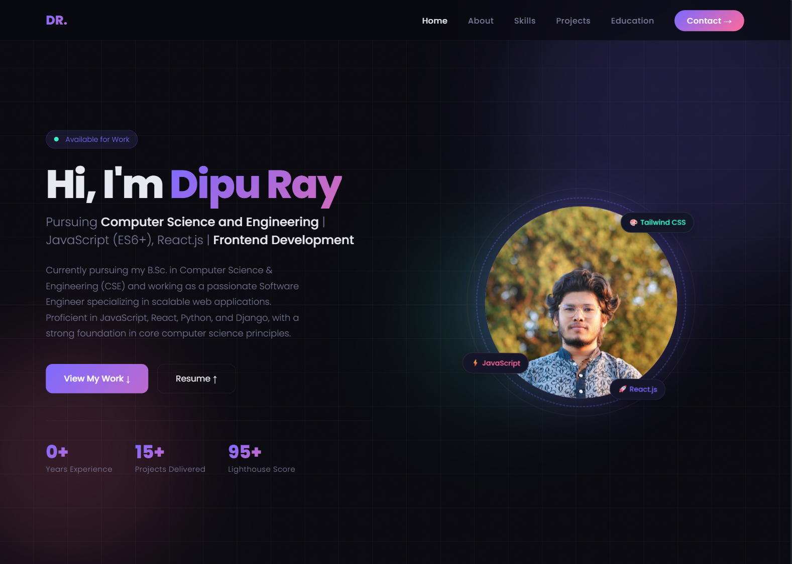
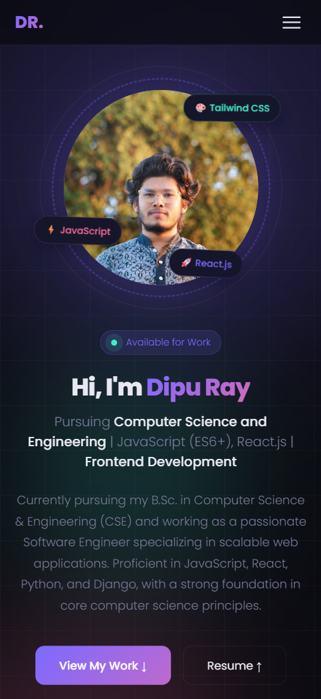

<div align="center">

# 🚀 Dipu Ray — Personal Portfolio

### Trainee Software Engineer (Frontend)

_Crafting clean UIs & smooth interactions_

[](https://dipu-ray.github.io/)
[](https://github.com/dipu-ray)
[](https://www.linkedin.com/in/dipu-ray/)
[](mailto:dipu34786@gmail.com)

</div>

**Started:** 03 June, 2025  
**Last Updated:** 20 June, 2026

---

## 👨‍💻 About

This is my personal portfolio website — built to showcase my skills, projects, and professional journey as a **Frontend Developer**. The site reflects my passion for clean UI, smooth interactions, and well-structured code.

---

## 📸 Preview

> Experience the seamless, responsive design of the application below, featuring a fluid grid for desktop monitors and an ultra-clean, touch-optimized interface for mobile screens.

<table>
  <tr>
    <td><b>💻 Desktop View</b></td>
    <td><b>📱 Mobile View</b></td>
  </tr>
  <tr>
    <td></td>
    <td></td>
  </tr>
</table>

---

## ✨ Features

- 🎨 Responsive design — mobile, tablet & desktop friendly
- ⚡ Fast loading & optimized performance
- ✨ CSS animation effects
- 📜 Smooth scrolling
- 🖥️ Projects showcase with live demo & GitHub links
- ⏳ Interactive vertical timeline UI
- 📬 Contact form with email integration

---

## 🛠️ Tech Stack

| Technology | Purpose          |
| ---------- | ---------------- |
| HTML       | Page Structure   |
| CSS        | Styling & Layout |
| JavaScript | Interactive      |

---

## 📁 Project Structure

```
portfolio/
├── assets/                         # Non code files
│   └── demo/                       # Portfolio Demo
│   └── images/                     # Images & Icon
│   └── projects/                   # Projects Photos
│   └── resume/                     # Resume or CV
├── README.md
└── index.html
└── script.js
└── style.css
```

---

## 🌐 Deployment

This project is deployed on **GitHub Pages**.

To deploy your own fork:

1. Go to your repository **Settings** on GitHub
2. Click on **Pages** in the left sidebar menu
3. Under **Build and deployment**, set the Source to **Deploy from a branch**
4. Choose your branch (usually `main` or `gh-pages`) and folder (usually `/root` or `/docs`)
5. Click Save — done! ✅

---

<div align="center">
  <sub>⚡ DESIGNED & DEVELOPED ⚡</sub>
  <br>
  <strong>🧬 DIPU RAY 🧬</strong>
  <br>
  <sup>✦ Driven by code • Fueled by coffee ✦</sup>
</div>
