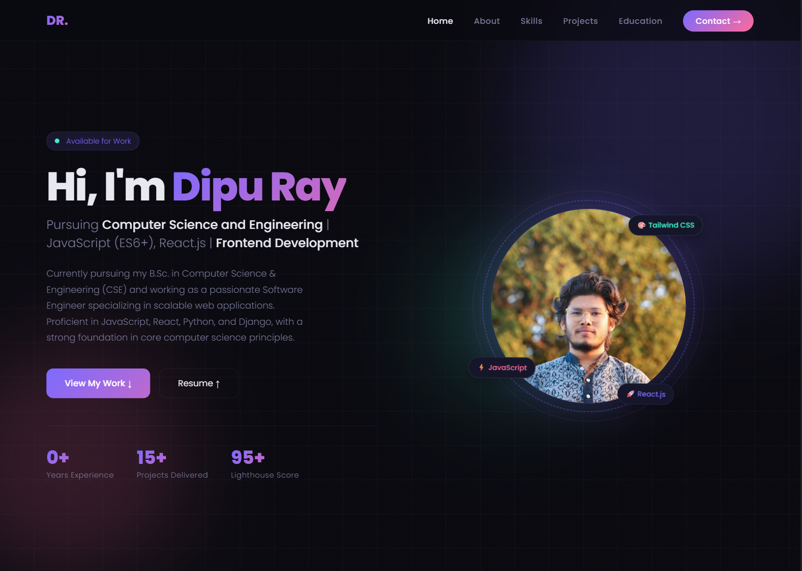
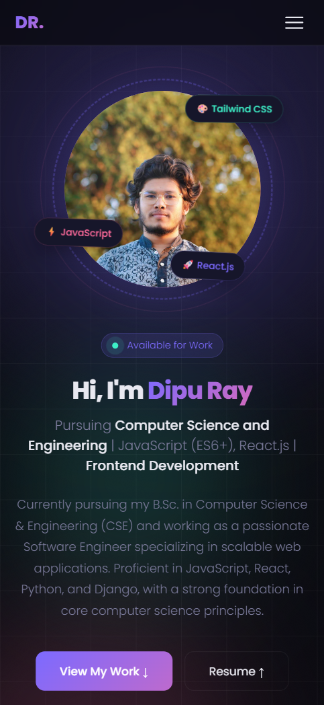

<div align="center">


# 🚀 Personal Portfolio

_Crafting clean UIs & smooth interactions, one component at a time._

<p>
  
</p>

<a href="https://github.com/dipu-ray">
  
</a>


</div>


## 📖 Table of Contents

- [About](#-about)
- [Preview](#-preview)
- [Features](#-features)
- [Tech Stack](#️-tech-stack)
- [Project Structure](#-project-structure)
- [Deployment](#-deployment)
- [Connect With Me](#-connect-with-me)

---

## 👨‍💻 About

This is my personal portfolio website — built from scratch to showcase my skills, projects, and professional journey as a **Frontend Developer**. Every section, from the hero banner to the contact form, is handcrafted with a focus on clean UI, smooth interactions, and well-structured, maintainable code.

> 💡 The goal wasn't just to build a portfolio — it was to practice real-world frontend engineering: responsive layouts, accessibility, performance, and thoughtful UX.

<div align="center">

|       🎯 Focus       |        🧩 Approach        |     🌱 Status     |
| :------------------: | :-----------------------: | :---------------: |
| Frontend Engineering | Mobile-first & Accessible | Actively Learning |

</div>

---

## 📸 Preview

> Experience the seamless, responsive design of the application below — a fluid grid for desktop monitors and an ultra-clean, touch-optimized interface for mobile screens.

<table>
  <tr>
    <td align="center"><b>💻 Desktop View</b></td>
    <td align="center"><b>📱 Mobile View</b></td>
  </tr>
  <tr>
    <td></td>
    <td></td>
  </tr>
</table>

---

## ✨ Features

|                             |                                                    |
| --------------------------- | -------------------------------------------------- |
| 🎨 **Responsive Design**    | Fully adaptive layout for mobile, tablet & desktop |
| ⚡ **Fast & Optimized**     | Lightweight assets and optimized load performance  |
| ✨ **Smooth Animations**    | Subtle CSS animations for a polished feel          |
| 📜 **Smooth Scrolling**     | Section-to-section scroll experience               |
| 🖥️ **Projects Showcase**    | Live demo & GitHub links for every project         |
| ⏳ **Interactive Timeline** | Vertical timeline UI for education & experience    |
| 📬 **Contact Form**         | Built-in contact form with email integration       |
| 🌗 **Clean Code Structure** | Organized, readable, and easy to extend            |

---

## 🛠️ Tech Stack

<div align="center">

<br><br>

|                                                    Technology                                                    | Purpose                          |
| :--------------------------------------------------------------------------------------------------------------: | :------------------------------- |
|                 | Page structure & semantic markup |
|                    | Styling, layout & animations     |
|  | Interactivity & DOM logic        |

</div>

---

## 📁 Project Structure

```
my-portfolio/
├── assets/
│   ├── docs/
│   │   └── resume.pdf
│   ├── icons/
│   │   └── favicon.png
│   └── images/
│       ├── preview/
│       │   ├── desktop.png
│       │   └── mobile.png
│       ├── profile/
│       │   ├── about.avif
│       │   └── hero.avif
│       └── projects/...
├── css/
│   └── style.css
├── js/
│   └── main.js
├── README.md
├── all-projects.html
└── index.html
```

---

## 🌐 Deployment

This project is deployed on **GitHub Pages**.

To deploy your own fork:

1. Go to your repository **Settings** on GitHub
2. Click on **Pages** in the left sidebar menu
3. Under **Build and deployment**, set the Source to **Deploy from a branch**
4. Choose your branch (usually `main`) and folder (usually `/root`)
5. Click **Save** — done! ✅

Your site will be live at `https://dipu-ray.github.io/`

<div align="center">

[](https://dipu-ray.github.io/)
[](./assets/docs/resume.pdf)

</div>

---


---

## 🤝 Connect With Me

<div align="center">

[](https://www.facebook.com/dipu.591)
[](https://www.instagram.com/dipu_ray.16/)
[](https://www.linkedin.com/in/dipu-ray/)
[](https://x.com/dipu_ray23)
[](https://wa.me/8801707747098)
[](mailto:dipu34786@gmail.com)

</div>

---

<div align="center">
  <sub>⚡ DESIGNED & DEVELOPED WITH ❤️ ⚡</sub>
  <br>
  <strong>🧬 DIPU RAY 🧬</strong>
  <br>
  <sup>✦ Driven by code • Fueled by coffee ✦</sup>
  <br><br>
  <sub>⭐ If you like this project, consider giving it a star!</sub>
</div>


